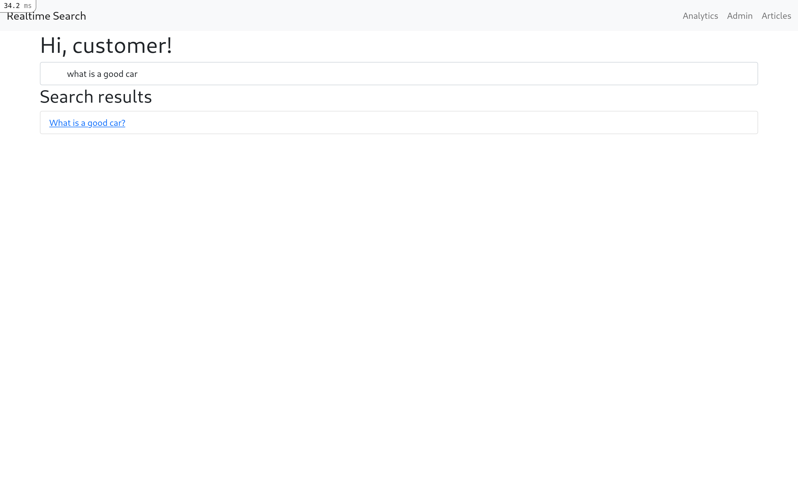
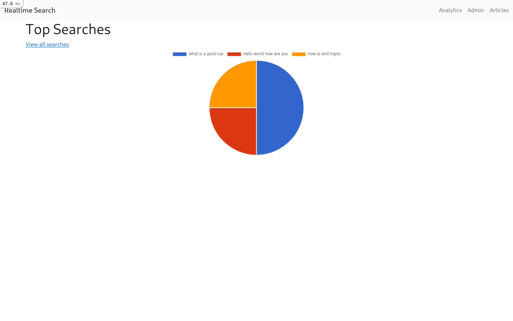
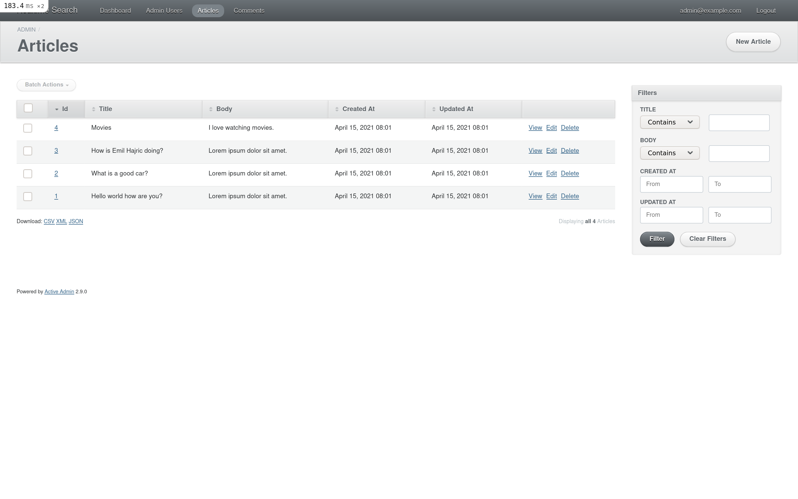

# Realtime Search

> Allow users to search for help articles in realtime and collect analytics about the searches.

## Screenshots

### Home page

### Top searches page

### ActiveAdmin interface


## Features

- Users can search for the articles they need in realtime
- Admin users can view analytics and trends about user searches
- Only admin users can create articles via the ActiveAdmin dashboard

## Built With

- Ruby
- Rails
- Bootstrap
- Stimulus.js
- ActiveAdmin
- PostgreSQL

## Live Demo

[Live Demo Link](https://realtime-search.herokuapp.com/)

### Test Admin Account

Email: admin@example.com

Password: password

## Getting Started

To get a local copy up and running follow these simple example steps.

### Prerequisites

- Ruby 2.7.2
- PostgreSQL
- yarn

### Setup

```bash
# Clone the repo
git clone https://github.com/meronokbay/realtime-search-articles.git

# cd into the cloned repo
cd realtime-search-articles
```
### Install

```bash
bundle install
yarn install
```

### Usage

```bash
# Create database
rails db:create

# Run migrations
rails db:migrate

# Seed the database with an admin account(email: 'admin@example.com', password: 'password')
rails db:seed

# Start your Rails server
rails server
```

Go to your favorite web browser and visit `http://localhost:3000`.

### Run tests

```bash
bundle exec rspec
```

## Author

👤 **Meron Ogbai**

- Github: [@meronokbay](https://github.com/meronokbay)
- Twitter: [@MeronDev](https://twitter.com/MeronDev)
- Linkedin: [Meron Ogbai](https://linkedin.com/in/meron-ogbai/)

## 🤝 Contributing

Contributions, issues, and feature requests are welcome!

## Show your support

Give a ⭐️ if you like this project!

## 📝 License

This project is [MIT](./LICENSE) licensed.
