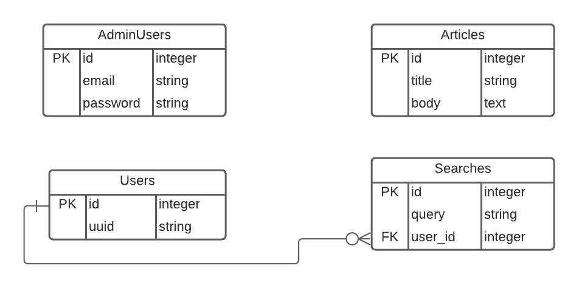

# Realtime Search

> Allow users to search for help articles in realtime and collect analytics about the searches.

## Screenshots

### Home page


### Top searches page


### ActiveAdmin interface


## Features

- Users can search for the articles they need in realtime
- Admin users can view analytics and trends about user searches
- Admin users can create articles via the ActiveAdmin dashboard

## FAQs

### How to search for articles?

Vist `/` and type into the search box.

### How to create, update or delete an article?

Go to the admin dashboard by visiting `/admin` and click on Articles in the navbar.

### How to view the analytics?

Go to `/searches` to look at all the searches with their analytics.

## Built With

- Ruby
- Rails
- Bootstrap
- Stimulus.js
- ActiveAdmin
- PostgreSQL

## Live Demo

[Live Demo Link](https://realtime-search.herokuapp.com/)

### Test Admin Account

Email: admin@example.com

Password: password

## Getting Started

To get a local copy up and running follow these simple example steps.

### Prerequisites

- Ruby 2.7.2
- PostgreSQL
- yarn

### Setup

```bash
# Clone the repo
git clone https://github.com/meronokbay/realtime-search-articles.git

# cd into the cloned repo
cd realtime-search-articles
```
### Install

```bash
bundle install
yarn install
```

### Usage

```bash
# Create database
rails db:create

# Run migrations
rails db:migrate

# Seed the database with an admin account(email: 'admin@example.com', password: 'password')
rails db:seed

# Start your Rails server
rails server
```

Go to your favorite web browser and visit `http://localhost:3000`.

### Run tests

```bash
bundle exec rspec
```

## Design

### Entity Relationship Diagram (ERD)



### Tracking a user

A user record is created in the Users table when a browser that doesn't have the user_uuid cookie visits the app. Then the user_uuid cookie is set in the browser which will help us keep track of what that user searches. I chose this approach to track users because it made much more sense to me when compared to forcing someone to authenticate before searching.

### Admin

I chose ActiveAdmin to build an admin dashboard because it simplifies the process of creating articles that can be seached and visited by normal users. It also makes it easier to only allow admins to view the analytics.

### Frontend

I used Bootstrap for styling the app, because it's perfect for simple and quick designs. I used Stimulus to handle the search. Debounced when used with Stimulus makes it easy to control the number of realtime search GET requests.

## Author

👤 **Meron Ogbai**

- Github: [@meronokbay](https://github.com/meronokbay)
- Twitter: [@MeronDev](https://twitter.com/MeronDev)
- Linkedin: [Meron Ogbai](https://linkedin.com/in/meron-ogbai/)

## 🤝 Contributing

Contributions, issues, and feature requests are welcome!

## Show your support

Give a ⭐️ if you like this project!

## Acknowledgements

- [unsplash](https://unsplash.com/photos/Oaqk7qqNh_c?utm_source=unsplash&utm_medium=referral&utm_content=creditShareLink)

## 📝 License

This project is [MIT](./LICENSE) licensed.
